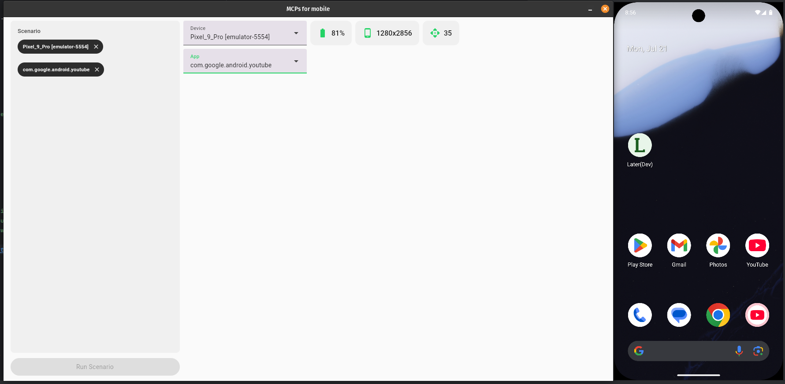

MCPs for Mobile
===============

MCPs for Mobile is a Kotlin project that enables control of Android devices or emulators through an AI agent. The agent
processes natural language commands and performs corresponding actions on connected Android devices—such as listing
installed apps, launching applications, and interacting with UI elements. It supports integration with local or cloud
based language models.
Features
--------

- AI-powered device control using Gemini or local models.
- Integration with ADB (Android Debug Bridge).
- Tool-based agent for device actions.
- Extensible with new tools and capabilities.
- Written in Kotlin Multiplatform for desktop execution.

Caution
-------

> [!CAUTION]
> This agent can execute ADB commands automatically in response to prompts, without confirmation. Use with care,
> especially for commands that modify app state or perform sensitive operations. Recommended for use in development
> environments or emulators.

Demo
----

Example prompt:

> Find available android device,
> List installed apps,
> Open "com.google.android.youtube" app,
> Dump ui and find Search bar, click it and type "First video in YouTube" and send done event,
> Dump ui search result list and tap first element in result list.
> As a result tell me what you see on screen and tell me which tool did you use

See demo video:

Getting Started
---------------

Prerequisites:

- Java Development Kit (JDK) 17 or higher
- IntelliJ IDEA or any Kotlin-compatible IDE with Gradle support
- Android SDK and ADB (Android Debug Bridge)
  - Install ADB via Android Studio or platform-tools
- Android emulator or device connected and recognized by `adb devices`

Roadmap
-------

- Improve UI dump quality and detail
- Support richer component hierarchies
- Add more ADB-based tools
- Improve error handling for device communication
- Refine layout structures for better LLM understanding
- Investigate migration from ddmlib to adblib

License
-------

This project is licensed under the Apache License 2.0 – see the [LICENSE](LICENSE) file for details.
